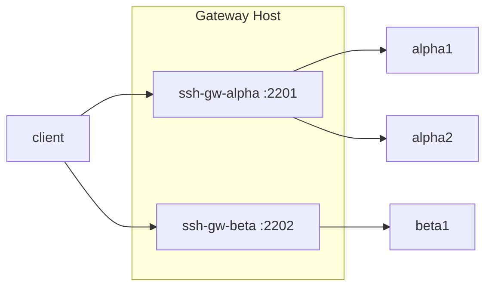

# SSH Gateway

Poor man's SSH gateway for multiple projects.



## Config

```yaml
project: alpha
key_provider: github
key_types:
  allowed: [ed25519]
reconcile_interval: 15m
users:
  - name: alice
    keys:
      - ssh-ed25519 AAAA... alice@laptop
  - name: bob
```

| Field | Description |
|-------|-------------|
| `project` | Project name (required) |
| `key_provider` | Default key source for users without explicit `keys`. Shorthands: `github`, `gitlab`, or a full URL base (e.g. `https://keys.example.com`). Keys are fetched from `<base>/<username>.keys`. |
| `key_types` | Filter keys by type (`ecdsa`, `ecdsa-sk`, `ed25519`, `ed25519-sk`, `rsa`). Use `allowed` or `disallowed`; if both are set, `allowed` wins. |
| `reconcile_interval` | Periodically re-fetch keys from `key_provider` or URL keys, without any config file change. Useful when team members rotate their GitHub/GitLab keys. Minimum `5s`. Omit to disable. |

## Run

```yaml
# compose.yml
services:
  ssh-gateway:
    image: ghcr.io/zachcheung/ssh-gateway
    restart: unless-stopped
    ports:
      - '2201:22'
    volumes:
      - .:/etc/ssh-gateway:ro
```

```sh
docker compose up -d
```

See [examples/](examples/) for multi-project and bind mount setups.

### Migrating existing host keys

Host keys are generated once on first start and reused on subsequent starts via the `/etc/ssh` volume. To migrate keys from an existing server, place them in the volume directory **before** starting the container — `GenerateHostKeys` skips generation if the files already exist:

```sh
cp /old-server/etc/ssh/ssh_host_*_key* ./ssh/
docker compose up -d
```

If the container is already running with auto-generated keys, copy the files then restart:

```sh
cp /old-server/etc/ssh/ssh_host_*_key* ./ssh/
docker compose restart ssh-gateway
```

Restarting is required because sshd loads host keys at startup and does not reload them at runtime.

## Reload

Config changes are detected automatically via filesystem watch — no manual step needed when the config file is bind-mounted from the host or updated via Docker volumes.

To trigger a reload manually (e.g. from a script):

```sh
docker compose kill -s HUP ssh-gateway
```

## SSH

Connect through the gateway as a jump host:

```sh
ssh -J alice@gateway:2201 alice@alpha1
```

Or in `~/.ssh/config`:

```
Host gw-alpha
  HostName gateway
  Port 2201
  User alice

Host alpha1
  ProxyJump gw-alpha
  User alice
```

## How It Works

A single host serves as SSH jump gateway for multiple projects, each with isolated users. One container per project, managed via YAML config.

The Go binary manages sshd and system users inside the container. It reconciles users and their `authorized_keys` on three triggers: startup, config file change (via inotify watch on the config directory), and `SIGHUP`. If `reconcile_interval` is set, keys are also re-fetched on a timer to pick up external key rotations without any config change. No shell access is granted (`ForceCommand /bin/false`). Host keys and home directories are persisted via Docker volumes.

## Development

Run the integration tests:

```sh
# --abort-on-container-exit stops all services when the test container exits
docker compose -f compose.test.yml up --build --abort-on-container-exit
```

## License

[MIT](LICENSE)
