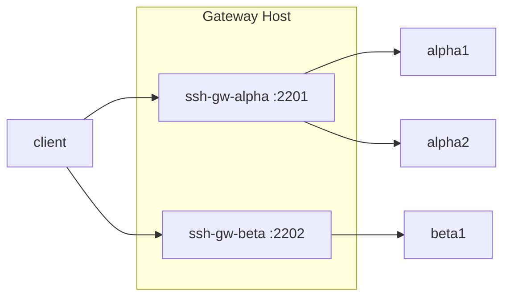

# SSH Gateway

A single host serving as SSH jump gateway for multiple projects, each with isolated users. One container per project, managed via YAML config.



## Config

```yaml
project: alpha
key_provider: github
key_types:
  allowed: [ed25519]
users:
  - name: alice
    keys:
      - ssh-ed25519 AAAA... alice@laptop
  - name: bob
```

Users without explicit `keys` are fetched from `key_provider` (e.g. `https://github.com/bob.keys`). Supported shorthands: `github`, `gitlab`, or a full URL.

`key_types` filters keys by type (`ecdsa`, `ecdsa-sk`, `ed25519`, `ed25519-sk`, `rsa`). Use `allowed` or `disallowed` (if both are set, `allowed` wins).

## Run

```yaml
# compose.yml
services:
  ssh-gateway:
    image: ghcr.io/zachcheung/ssh-gateway
    restart: unless-stopped
    ports:
      - '2201:22'
    volumes:
      - .:/etc/ssh-gateway:ro
```

```sh
docker compose up -d
```

See [examples/](examples/) for multi-project and bind mount setups.

## Reload

After editing the config, send `SIGHUP` to reload without restarting:

```sh
docker compose kill -s HUP ssh-gateway
```

## SSH

Connect through the gateway as a jump host:

```sh
ssh -J alice@gateway:2201 alice@alpha1
```

Or in `~/.ssh/config`:

```
Host gw-alpha
  HostName gateway
  Port 2201
  User alice

Host alpha1
  ProxyJump gw-alpha
  User alice
```

## How It Works

The Go binary manages sshd and system users inside the container. On startup and on `SIGHUP`, it reads the config and reconciles users and their `authorized_keys`. No shell access is granted (`ForceCommand /bin/false`). Host keys and home directories are persisted via Docker volumes.

## Development

Run the integration tests:

```sh
# --abort-on-container-exit stops all services when the test container exits
docker compose -f compose.test.yml up --build --abort-on-container-exit
```

## License

[MIT](LICENSE)
